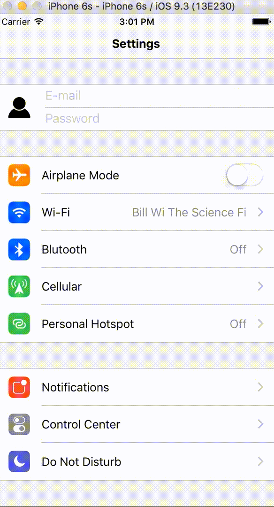
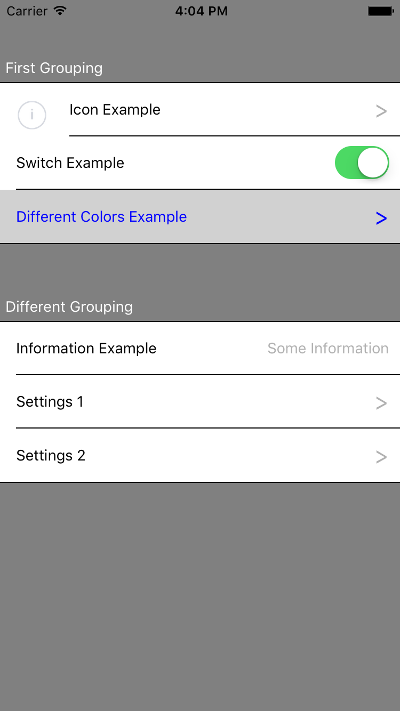
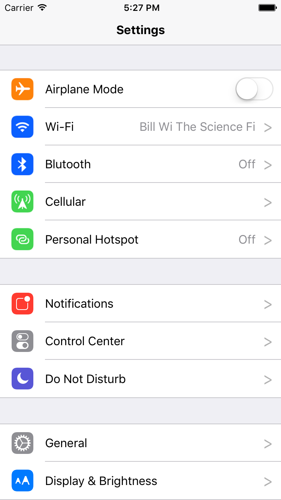
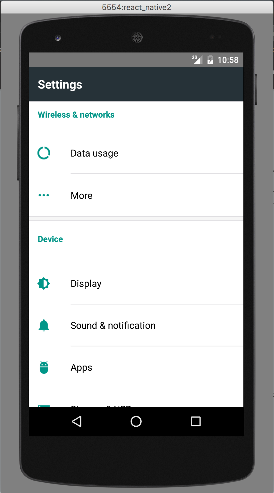

# react-native-settings-list

*Updated fork of [evetstech/react-native-settings-list](https://github.com/evetstech/react-native-settings-list) (unmaintained)*

A clean and highly customizable React Native implementation of a list of settings for a settings page.


[](https://github.com/swrlab/react-native-settings-list)
[](https://www.npmjs.com/package/react-native-settings-list)

**Quick Access**

- [react-native-settings-list](#react-native-settings-list)
  - [Installation](#installation)
  - [Usage](#usage)
  - [Prop values](#prop-values)
    - [\<SettingsList\>](#settingslist)
    - [\<SettingsList.Header\>](#settingslistheader)
    - [\<SettingsList.Item\>](#settingslistitem)
  - [Simple Example](#simple-example)
  - [Realistic examples](#realistic-examples)
    - [iOS Settings](#ios-settings)
    - [Android Settings](#android-settings)
  - [Contributing](#contributing)

## Installation

---
Install the module with yarn:

```sh
yarn add react-native-settings-list@swrlab/react-native-settings-list
```

or npm:

```sh
npm install react-native-settings-list@swrlab/react-native-settings-list --save
```

## Usage

---
In your code, simply require/import the module:

```js
import SettingsList from 'react-native-settings-list'
```

**New changes/additions**

- See [CHANGELOG.md](CHANGELOG.md) for a list of recent changes
- Ability for an authorization-type component [example updated to show a practical use]
  - Allows for complete customization of the TextInput by passing into the two props authPropsUser and authPassPW (overwrites defaults
  - Uses existing onPress prop for callback
  - Preview:  
    
- Ability for custom arrow image/component
  - Simply use the new arrowIcon prop to inject any type of object as the new arrow (with proper style formatting)
- Added defaultTitleStyle prop to \<SettingsList> to set the style of the tiles for all children removing the need for duplicate code

## Prop values

---

### \<SettingsList\>

The following props are used:

| Name              | Description                                    | Type                   |
| ----------------- | ---------------------------------------------- | ---------------------- |
| backgroundColor   | Sets default background color for all children | React.PropTypes.string |
| borderColor       | Sets default border color for all children     | React.PropTypes.string |
| defaultItemSize   | Sets default width for all children            | React.PropTypes.number |
| underlayColor     | Sets default underlayColor for all children    | React.PropTypes.string |
| defaultTitleStyle | Sets default style for all children's titles   | React.PropTypes.string |

### \<SettingsList.Header\>

The following props are used:

| Name        | Description                             | Type                   |
| ----------- | --------------------------------------- | ---------------------- |
| headerText  | Text for the header                     | React.PropTypes.string |
| headerStyle | Sets border color for the settings list | Text.propTypes.style   |
| headerRef   | Sets a `ref` on the header component    | React.PropTypes.func   |

### \<SettingsList.Item\>

The following props are used:

| Name                | Description                                                                                              | Type                   |
| ------------------- | -------------------------------------------------------------------------------------------------------- | ---------------------- |
| title               | Text for the item                                                                                        | React.PropTypes.string |
| titleStyle          | Text Style                                                                                               | Text.propTypes.style   |
| icon                | A component for the icon.  Doesn't need to be an image                                                   | React.PropTypes.node   |
| itemWidth           | Changes the individual item's width.  Overwrites **\<SettingsLists>** defaultItemSize                    | React.PropTypes.number |
| backgroundColor     | Changes the individual item's background color.  Overwrites default **\<SettingsList>** backgroundColor  | React.PropTypes.string |
| underlayColor       | Changes the individual item's underlayColor color.  Overwrites default **\<SettingsList>** underlayColor | React.PropTypes.string |
| onPress             | On press Callback for item [used for auth callback as well]                                              | React.PropTypes.func   |
| hasNavArrow         | Displays a navigation arrow                                                                              | React.PropTypes.bool   |
| arrowStyle          | Style for the navigation arrow                                                                           | Image.propTypes.style  |
| arrowIcon           | Inject custom arrow into the end of the item                                                             | React.PropTypes.node   |
| hasSwitch           | Enable a switch component                                                                                | React.PropTypes.bool   |
| switchProps         | RN switch props                                                                                          | React.PropTypes.object |
| switchOnValueChange | On switches value change callback                                                                        | React.PropTypes.func   |
| titleInfo           | Right side title information string                                                                      | React.PropTypes.string |
| titleInfoStyle      | Style for title information string                                                                       | Text.propTypes.style   |
| isAuth              | Sets item as an authorization item                                                                       | React.PropTypes.bool   |
| authPropsUser       | Changes the props for the first TextInput component; overwrites default                                  | React.PropTypes.node   |
| authPropsPW         | Changes the props for the second TextInput component; overwrites default                                 | React.PropTypes.node   |
| itemRef             | Sets a `ref` on the TouchableHighlight that SettingsList.Item renders to                                 | React.PropTypes.func   |

## Simple Example

---

Here is a simple example of the different things you can do with the module:



Checkout the code: [example/settings/simple.js](example/settings/simple.js)

## Realistic examples

### iOS Settings

Here is an example that looks very close to the default iPhone settings page.



Checkout the code: [example/settings/iphone.js](example/settings/iphone.js)

### Android Settings

Another example shows the Android settings page.



Checkout the code: [example/settings/android.js](example/settings/android.js)

## Contributing

Feel free to do pull requests if a certain feature you want is missing.  I accept all PR's that are enhancements to the project.
